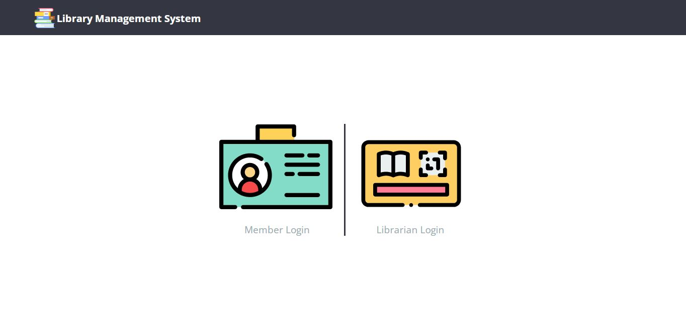
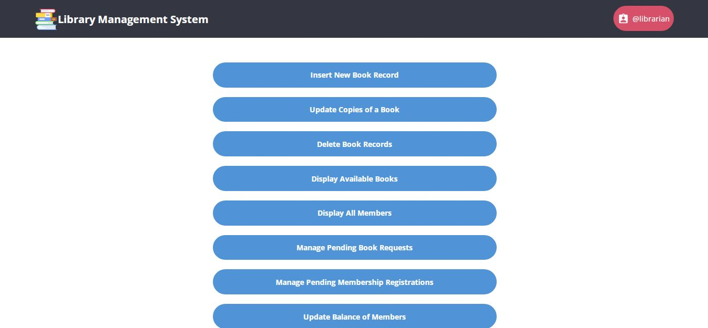
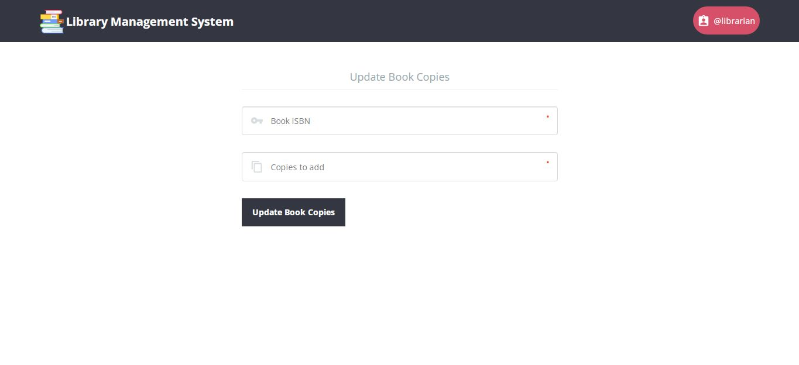
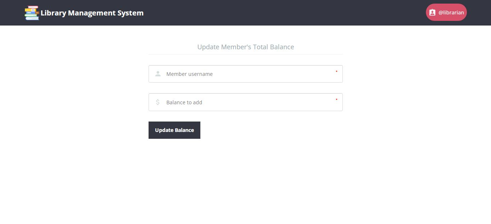

# Library Management System
This simple PHP project covers all of the required and important features. It can be used as a college project for PHP by first-year and second-year IT students. 

It offers a variety of features that allow users to engage in the same way as in a library, such as requesting books, setting due dates, and so on. The concept is similar to a real-life situation and is well-implemented as a web application.

## How to Run This Project
Follow the steps below should be performed after you’ve started Apache and MySQL server in XAMPP.(windows)
- Extract the File.
- Copy the Main project folder Paste into C:\xampp\htdocs\

### Process to Connect Database with Project
- Open a browser and type http://localhost/phpmyadmin/ into the address bar.
- After that go to the databases tab.
- Name your database "lms" and then go to the import tab.
- Upload SQL File From Project folder.

Note : Don't Forgot to add mail credentials to sendmail.php

#### Ready to Run the Project
http://localhost/Library-Management-System

- UserName For Librarian : librarian
- Password For Librarian : librarian

## Screenshots

## Contribution
Added Mail Functionality and 2 Modules in Librarian Section
- Swarup Kanade [@swarupkanade](https://www.github.com/swarupkanade)
- Omkar Kanade [@omkarkanade](https://www.github.com/omkarkanade)

## Original Source
- [@psyclone20](https://github.com/psyclone20/Library)